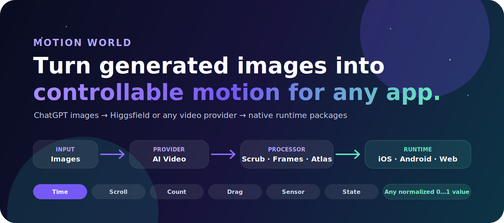
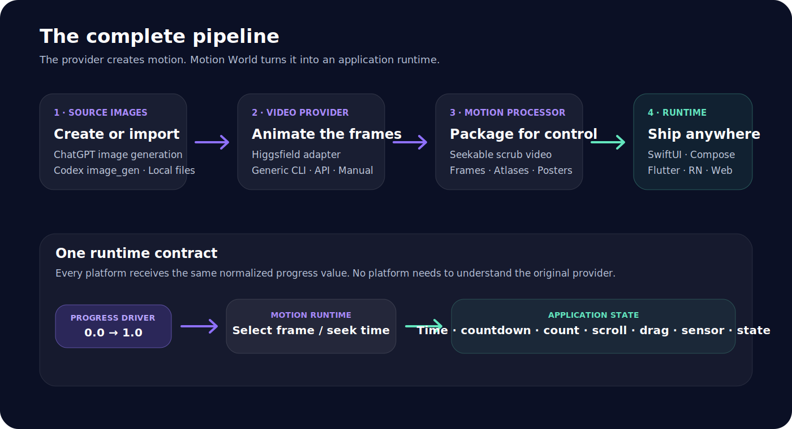
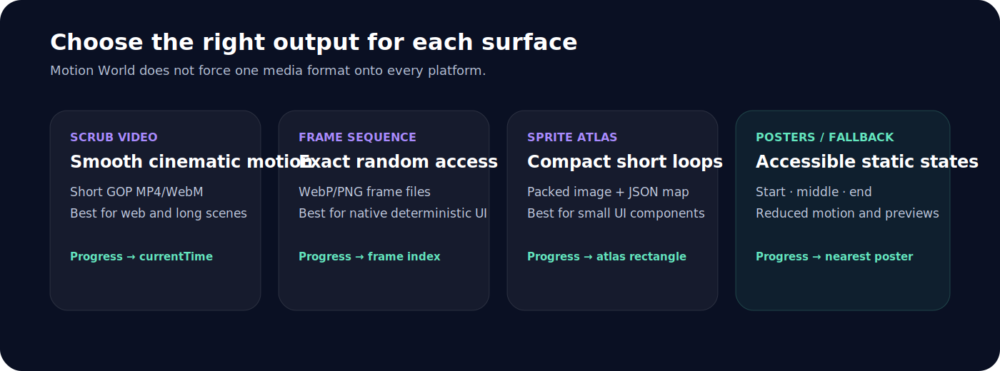
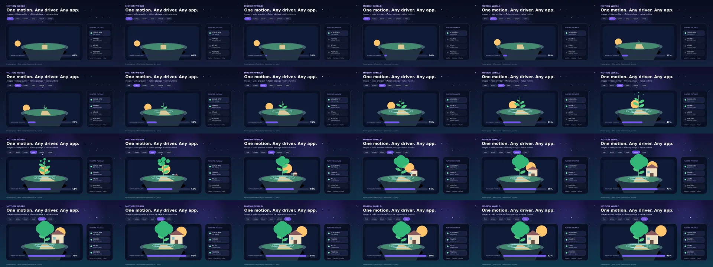
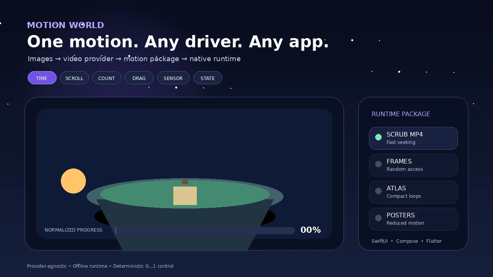
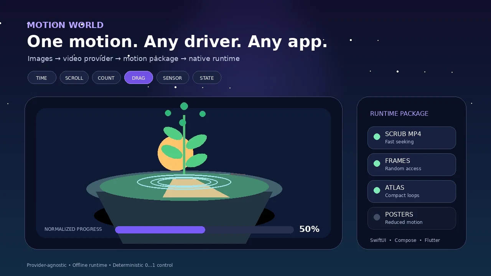
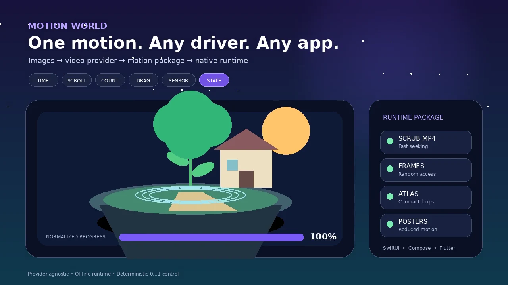

<p align="center">
  
</p>

<p align="center">
  <strong>Generate the visuals once. Drive the motion from anything.</strong><br>
  Turn images from ChatGPT, Codex, or any image model into video with Higgsfield or another provider, then package that video as progress-controlled motion for iOS, Android, Flutter, React Native, and the web.
</p>

<p align="center">
  <a href="#quick-start"></a>
  <a href="skills/motion-world/SKILL.md"></a>
  <a href="README_AR.md"></a>
  <a href="LICENSE"></a>
</p>

<p align="center">
  
</p>

---

## What Motion World actually does

Most AI-video workflows stop at an MP4. Motion World treats that MP4 as an intermediate motion source.

```text
Prompt or reference images
        ↓
ChatGPT / Codex / another image generator
        ↓
Higgsfield / another video provider
        ↓
Scrub-ready MP4 · frame sequence · sprite atlas · fallback posters
        ↓
SwiftUI · Jetpack Compose · Flutter · React Native · Web
        ↓
Time · countdown · counter · scroll · drag · sensor · state · network progress
```

The same animation can respond to a 20-minute focus session, a checkout-progress value, page scroll, drag position, a workout counter, upload status, or any application value normalized to `0...1`.

<p align="center">
  
</p>

## Why this is different

| Ordinary AI-video workflow | Motion World |
|---|---|
| Produces a video to play from start to finish | Produces motion that can be positioned at any progress value |
| Tied to one provider | Provider adapters for Higgsfield, shell commands, manual exports, and future HTTP providers |
| Video is the final output | Video is converted into runtime packages |
| One implementation per platform | One motion contract with adapters for five application stacks |
| Playback controls the state | Your application state controls the motion |
| Often depends on a network request | Runtime package can work fully offline |

## Output formats

Motion World can package a generated video in four complementary ways.

<p align="center">
  
</p>

### Scrub-ready MP4

A small-GOP H.264 encode that can seek forward or backward from a normalized progress value. Best when visual fidelity and compact packaging matter.

### Frame sequence

Numbered WebP frames such as `frame_0000.webp`. Best when exact frame choice matters or native video seeking is unreliable.

### Sprite atlas

A PNG atlas plus JSON coordinates. Best for short UI motion and runtimes that benefit from one decoded texture.

<p align="center">
  
</p>

### Fallback posters

Static start, middle, and end images for reduced motion, low-memory devices, loading placeholders, previews, and failure handling.

<table>
  <tr>
    <td align="center"><br><strong>0%</strong></td>
    <td align="center"><br><strong>50%</strong></td>
    <td align="center"><br><strong>100%</strong></td>
  </tr>
</table>

## The motion contract

Every runtime receives a normalized value:

```text
progress = 0.0  → first frame
progress = 0.5  → middle frame
progress = 1.0  → final frame
```

The driver can be replaced without changing the animation package.

| Driver | Example mapping |
|---|---|
| Elapsed time | `(now - start) / (end - start)` |
| Countdown | `1 - remaining / duration` |
| Counter | `completed / target` |
| Scroll | `scrollOffset / scrollableDistance` |
| Drag | `translation / dragRange` |
| Sensor | Normalize a measured range into `0...1` |
| State machine | Assign each state a checkpoint or range |
| Network progress | `uploadedBytes / totalBytes` |
| Audio | Normalize amplitude, beat position, or playback time |
| Custom | Any deterministic value from `0` to `1` |

Read the complete driver reference in [`progress-drivers.md`](skills/motion-world/references/progress-drivers.md).

## Supported application runtimes

| Platform | Included adapter | Typical renderer |
|---|---|---|
| iOS / macOS | Swift | `AVPlayerItemVideoOutput` or frame sequence |
| Android | Kotlin | Media3 or Compose frame sequence |
| Flutter | Dart | Video controller or asset frames |
| React Native | TypeScript | Native video or image sequence |
| Web | JavaScript | Video seeking, canvas, or image sequence |

The installer copies the selected adapters into a generated integration directory:

```bash
python3 skills/motion-world/scripts/install_runtime_adapters.py motion-project.json
```

## Image generation

Motion World is image-provider agnostic.

### ChatGPT or Codex image generation

Ask the agent to generate the approved start image, end image, or scene sequence. Keep the camera, aspect ratio, lighting, palette, and subject identity consistent.

```text
Create a 9:16 start frame and end frame for a premium productivity app.
The start frame shows an empty floating island at dawn.
The end frame shows the same island, same camera, and same horizon,
now completed with vegetation, water, warm lights, and subtle atmosphere.
No text, no logo, no interface, no camera change.
```

The skill includes prompt rules in [`image-prompts.md`](skills/motion-world/references/image-prompts.md) and a Codex adapter guide in [`codex-image-gen.md`](skills/motion-world/references/providers/image/codex-image-gen.md).

### Existing images

You can skip generation and provide artwork from your designer, application asset package, stock library, render pipeline, or another model.

Motion World audits:

- Image dimensions and orientation.
- Camera and anchor consistency.
- Subject identity.
- Background and alpha requirements.
- Text baked into artwork.
- Start/end compatibility.
- Runtime memory cost.

## Video generation

### Higgsfield

The included provider runner can plan or execute a Higgsfield image-to-video job.

```bash
python3 skills/motion-world/scripts/provider_runner.py \
  --project motion-project.json \
  --clip hero-growth \
  --execute
```

The runner:

1. Reads the project manifest.
2. Resolves the start, end, and reference images.
3. Checks the selected provider and model configuration.
4. Builds the provider command.
5. Runs the generation.
6. Stores the raw response for diagnosis.
7. Downloads or resolves the resulting video.
8. Hands it to the packaging pipeline.

See [`higgsfield.md`](skills/motion-world/references/providers/video/higgsfield.md).

### Any other video platform

Use one of these provider modes:

- `generic_shell`: describe a CLI command template.
- `manual`: generate elsewhere, then place the returned MP4 at the expected path.
- `generic_http`: implement an API adapter using the documented provider contract.

The provider contract lives in [`provider-contract.md`](skills/motion-world/references/provider-contract.md).

## Quick start

### Requirements

- Python 3.10 or newer.
- `ffmpeg` and `ffprobe`.
- Pillow for frame and atlas processing.
- A video provider only when generating a new video.

macOS:

```bash
brew install ffmpeg python
python3 -m pip install Pillow jsonschema
```

Ubuntu / Debian:

```bash
sudo apt update
sudo apt install -y ffmpeg python3 python3-pip
python3 -m pip install Pillow jsonschema
```

### 1. Install the skill

With the skills CLI:

```bash
npx skills add Nasser934/motion-world
```

For Codex directly:

```bash
npx skills add Nasser934/motion-world -a codex
```

Manual installation:

```bash
git clone https://github.com/Nasser934/motion-world.git
mkdir -p ~/.codex/skills
cp -R motion-world/skills/motion-world ~/.codex/skills/
```

### 2. Create a project

```bash
python3 skills/motion-world/scripts/init_project.py \
  --name "product-growth" \
  --orientation portrait \
  --output motion-project.json
```

Or start from the generic example:

```bash
cp skills/motion-world/references/examples/generic-growth.motion-project.json \
   motion-project.json
```

### 3. Validate it

```bash
python3 skills/motion-world/scripts/validate_project.py motion-project.json
```

### 4. Plan or run video generation

Preview the provider command without spending credits:

```bash
python3 skills/motion-world/scripts/provider_runner.py \
  --project motion-project.json \
  --clip hero-growth
```

Run it:

```bash
python3 skills/motion-world/scripts/provider_runner.py \
  --project motion-project.json \
  --clip hero-growth \
  --execute
```

### 5. Package the video

```bash
python3 skills/motion-world/scripts/prepare_motion.py \
  --project motion-project.json \
  --clip hero-growth
```

Generated output:

```text
build/hero-growth/
├── scrub/
│   └── master.mp4
├── frames/
│   ├── frame_0000.webp
│   ├── frame_0001.webp
│   └── ...
├── atlas/
│   ├── atlas.json
│   ├── atlas_000.png
│   └── ...
├── posters/
│   ├── start.webp
│   ├── middle.webp
│   └── end.webp
└── motion-runtime.json
```

### 6. Generate platform integration files

```bash
python3 skills/motion-world/scripts/install_runtime_adapters.py motion-project.json
```

Then copy the generated adapter and package into your application target.

## Project manifest

`motion-project.json` is the portable contract between image generation, video generation, processing, and application integration.

```json
{
  "schemaVersion": "1.0",
  "name": "product-growth",
  "canvas": {
    "width": 1080,
    "height": 1920,
    "orientation": "portrait"
  },
  "providers": {
    "video": {
      "type": "higgsfield",
      "model": "seedance_2_0"
    }
  },
  "clips": [
    {
      "id": "hero-growth",
      "startImage": "assets/start.png",
      "endImage": "assets/end.png",
      "prompt": "One continuous controlled transformation, no cuts...",
      "sourceVideo": "build/raw/hero-growth.mp4",
      "outputs": ["scrubVideo", "frames", "atlas", "posters"]
    }
  ],
  "runtimes": ["ios", "android", "flutter", "react-native", "web"]
}
```

Validate against [`motion-project.schema.json`](skills/motion-world/references/motion-project.schema.json).

## SwiftUI example

```swift
import SwiftUI

struct ProgressScene: View {
    let startedAt: Date
    let endsAt: Date

    var body: some View {
        TimelineView(.animation(minimumInterval: 1.0 / 30.0)) { context in
            let progress = MotionProgress.elapsed(
                now: context.date,
                start: startedAt,
                end: endsAt
            )

            FrameSequenceView(
                progress: progress,
                frameCount: 120,
                assetName: { index in
                    String(format: "frame_%04d", index)
                }
            )
        }
    }
}
```

`TimelineView` refreshes the UI. Your stored start and end timestamps remain the source of truth.

## Web example

```html
<video id="motion" muted playsinline preload="auto" src="master.mp4"></video>
<script src="motion-runtime.js"></script>
<script>
  const runtime = createMotionRuntime(document.querySelector('#motion'));

  addEventListener('scroll', () => {
    const distance = document.documentElement.scrollHeight - innerHeight;
    runtime.setProgress(distance > 0 ? scrollY / distance : 0);
  });
</script>
```

## Frame-sequence example

```javascript
function frameIndex(progress, frameCount) {
  const p = Math.min(1, Math.max(0, progress));
  return Math.round(p * (frameCount - 1));
}

const filename = `frame_${String(frameIndex(progress, 120)).padStart(4, '0')}.webp`;
```

## Reduced motion

Every production integration should provide a reduced-motion path.

Recommended behavior:

- Use a static poster or a few checkpoint crossfades.
- Do not repeatedly scrub video.
- Preserve the same state meaning at 0%, 50%, and 100%.
- Keep text and actions usable without motion.
- Respect the platform's accessibility setting.

## Performance guidance

### Scrub video

- Encode H.264 with frequent keyframes.
- Disable audio unless required.
- Preload only the active clip.
- Avoid issuing another seek while a seek is pending.
- Keep a poster visible until the first decoded frame appears.

### Frame sequence

- Choose a practical frame rate such as 12–30 fps based on motion detail.
- Load nearby frames instead of decoding the entire sequence.
- Use WebP or another runtime-appropriate format.
- Keep file names zero-based and deterministic.

### Sprite atlas

- Stay within target GPU texture limits.
- Split large animations into multiple atlases.
- Include coordinates and frame order in JSON.
- Measure decoded texture memory, not only compressed file size.

## Quality gates

The skill should reject or flag:

- Start and end images with different cameras.
- A horizontal source used as an accidental portrait crop.
- Provider output with visible cuts when continuity was requested.
- Text or interface elements baked into the generated image.
- Missing first or final frames.
- Frame numbering that does not start at zero.
- Video without predictable seeking.
- A runtime that calculates business state independently.
- Missing reduced-motion fallback.
- Provider credentials committed to source control.

Run repository verification:

```bash
bash scripts/verify.sh
```

## Repository structure

```text
motion-world/
├── skills/motion-world/
│   ├── SKILL.md
│   ├── references/
│   │   ├── examples/
│   │   ├── providers/
│   │   └── runtimes/
│   └── scripts/
├── docs/
│   ├── GUIDE_AR.md
│   ├── PUBLISH_AR.md
│   └── media/
├── scripts/
│   ├── render_readme_demo.py
│   ├── publish.sh
│   ├── publish.ps1
│   └── verify.sh
├── README.md
├── README_AR.md
├── CONTRIBUTING.md
├── SECURITY.md
├── CHANGELOG.md
└── LICENSE
```

## Examples

### Generic growth

[`generic-growth.motion-project.json`](skills/motion-world/references/examples/generic-growth.motion-project.json) demonstrates the complete provider and runtime contract without tying the skill to one application.

### Sukun oasis

[`sukun-oasis.motion-project.json`](skills/motion-world/references/examples/sukun-oasis.motion-project.json) is an optional example showing a prayer-focus oasis driven by real session time. It is not the skill's identity and does not place the generic skill inside the Sukun repository.

## Security

- Never commit provider keys, cookies, OAuth tokens, or generated private URLs.
- Prefer local environment variables and provider-native authentication.
- Review generated media before distribution.
- Treat prompts and provider responses as project artifacts that may contain sensitive details.

See [`SECURITY.md`](SECURITY.md).

## Contributing

Provider adapters, runtime integrations, test fixtures, and documentation improvements are welcome. Read [`CONTRIBUTING.md`](CONTRIBUTING.md) before opening a pull request.

## Attribution

Motion World was inspired in part by the progress-scrubbing, mobile-composition, and media-pipeline concepts in the MIT-licensed [`scroll-world`](https://github.com/oso95/scroll-world) skill. Motion World uses a different provider-agnostic architecture focused on reusable application runtimes and normalized state drivers.

See [`NOTICE`](NOTICE) for attribution details.

## License

MIT. See [`LICENSE`](LICENSE).
